# CompressAI Visual Diagram Pack

This page collects the main block diagrams, architecture diagrams, working diagrams, and result graphs for the Space Semantic Compression project.

Generated image files are saved in:

`figures/project_diagrams/`

## 1. System Architecture

Use this diagram to explain the software platform.

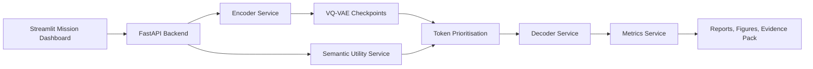

Image file:

`figures/project_diagrams/01_system_architecture.png`

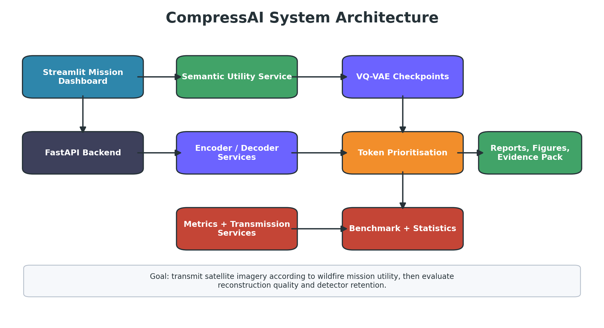

## 2. Working Pipeline

Use this diagram in the PhD proposal methodology section.

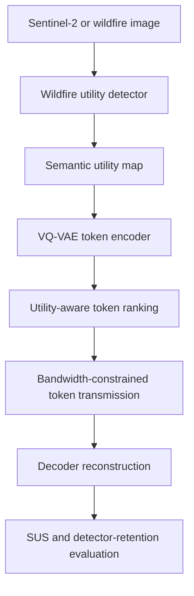

Image file:

`figures/project_diagrams/02_working_pipeline.png`

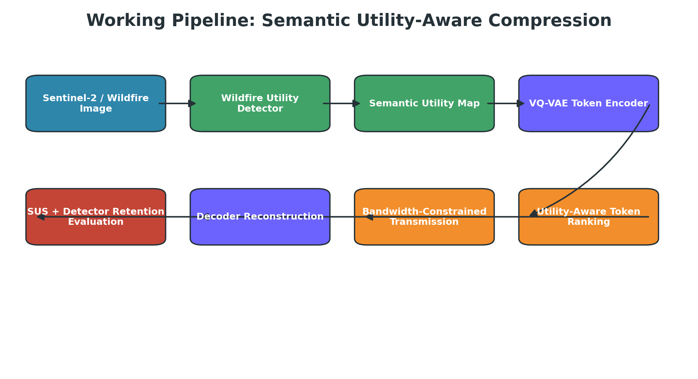

## 3. Token Transmission Working Diagram

Use this when explaining the core invention or research concept.

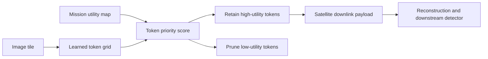

Image file:

`figures/project_diagrams/03_token_transmission_working_diagram.png`

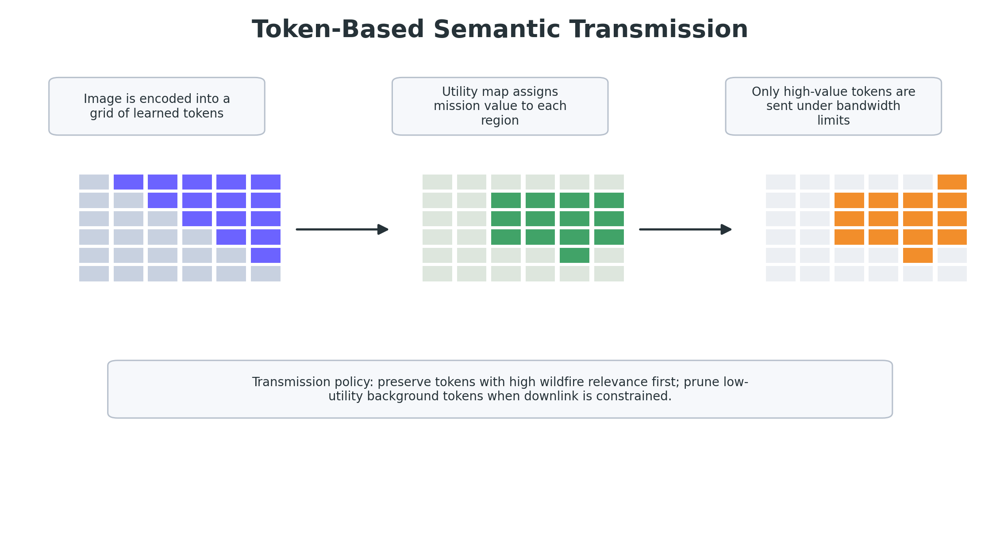

## 4. Research Benchmark Pipeline

Use this for research reports and supervisor discussions.

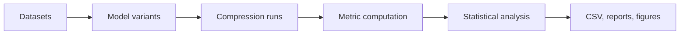

Image file:

`figures/project_diagrams/04_experiment_validation_pipeline.png`

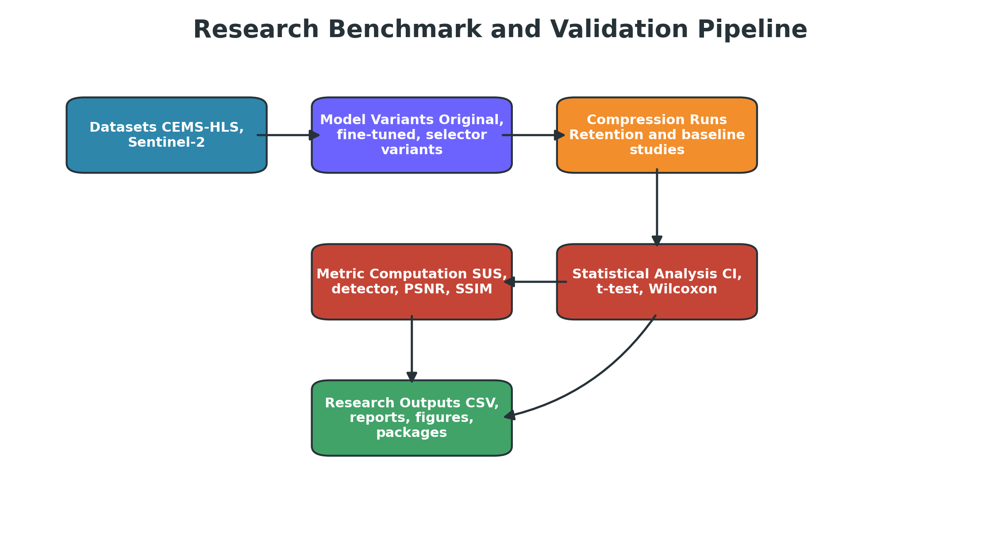

## 5. Career Evidence Positioning

Use this to explain how the same project supports patent strategy, PhD applications, Innovator Founder evidence, and Global Talent evidence.

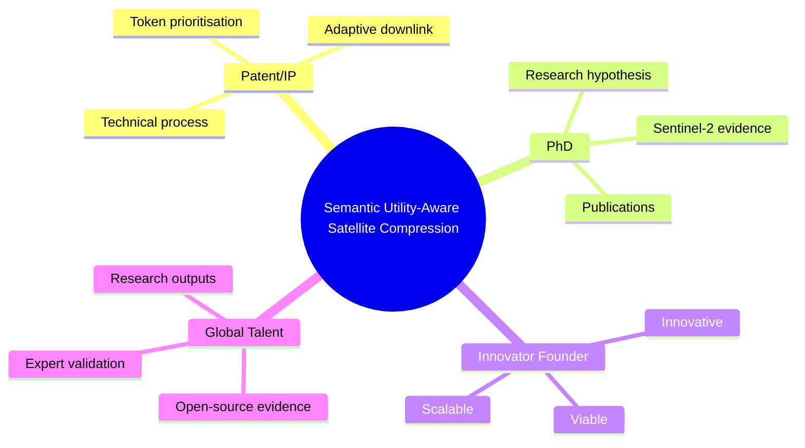

Image file:

`figures/project_diagrams/05_career_evidence_positioning.png`

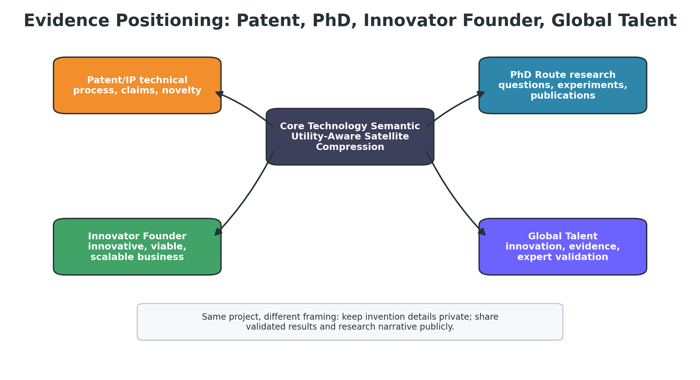

## 6. Result Graphs

These graphs are generated from the 500-patch Sentinel-2 benchmark.

| Figure | Purpose |
|---|---|
| `06_sentinel2_metric_comparison.png` | Compare original and regularized VQ-VAE across SUS, detector retention, PSNR, SSIM, compression ratio, and bandwidth saved |
| `07_paired_effects_ci.png` | Show paired mean effects with bootstrap 95% confidence intervals |
| `08_model_decision_tradeoff.png` | Explain why the regularized model is not promoted as default yet |

### Sentinel-2 Metric Comparison

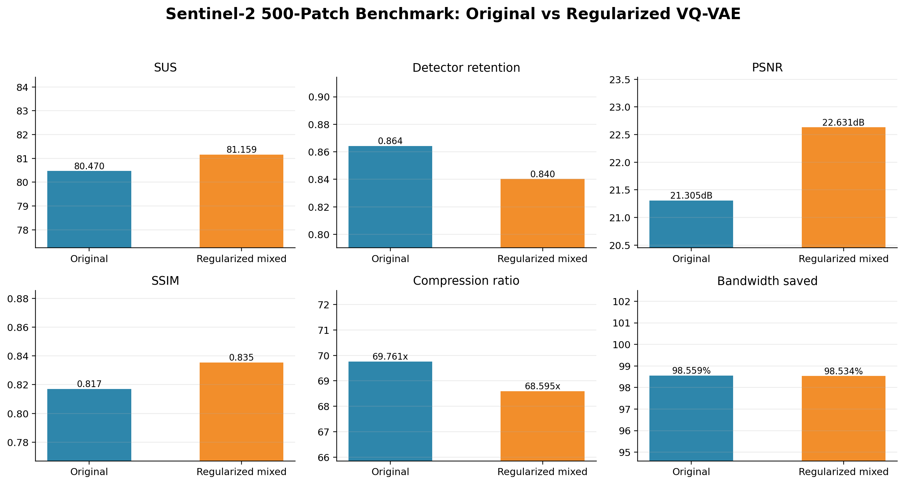

### Paired Effects With Confidence Intervals

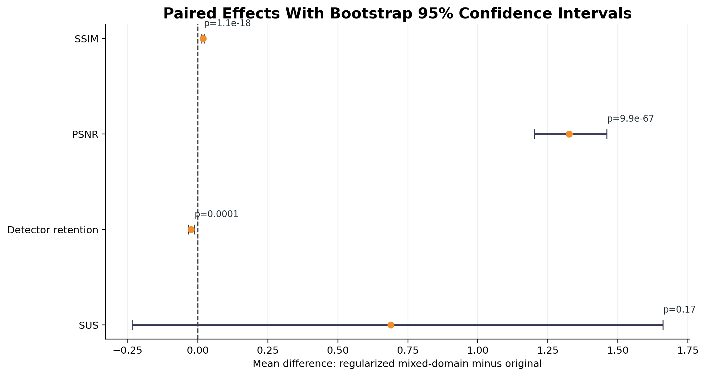

### Model Promotion Trade-Off

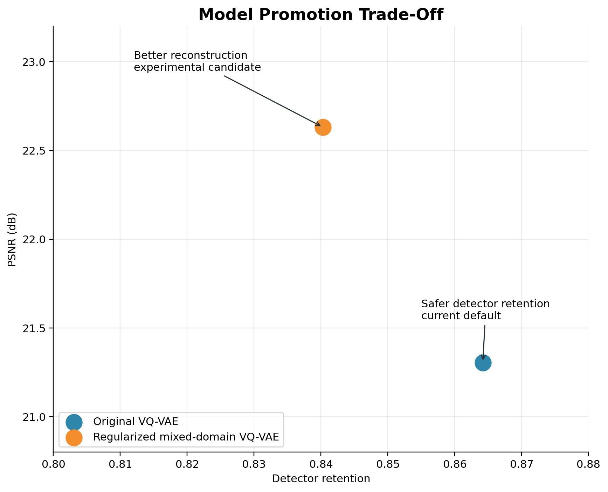

## Regeneration Command

```powershell
C:\Conda\envs\img2word\python.exe scripts\generate_project_diagrams.py
```
