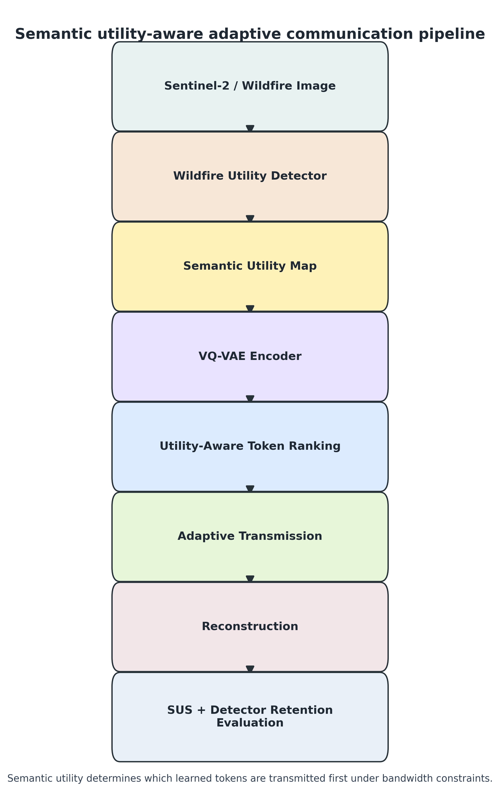

# Semantic Utility-Aware Adaptive Communication for Wildfire-Centric Earth Observation Systems Under Resource Constraints

**PhD Research Proposal**

**Applicant:** Athul Jayakumar

**Research area:** Earth Observation AI, semantic communication, wildfire monitoring, learned image compression, and satellite edge intelligence

**Target research environments:** University of Luxembourg SnT, TU Delft, ESA-affiliated Earth Observation projects, DLR, and European AI-for-space research groups

**Prepared as a final supervisor-ready proposal for fully funded PhD applications**

---

## Abstract

Earth Observation missions now collect imagery at a scale that is growing faster than available downlink capacity, onboard storage, and energy budgets. This imbalance is particularly visible in wildfire monitoring, where the value of an image is not determined only by visual fidelity but by whether fire, smoke, burn scar, and affected landscape evidence remain available for interpretation. Conventional codecs such as JPEG, JPEG2000, and operational space compression standards are mature and essential, but they are primarily designed around rate-distortion performance rather than mission-specific utility.

This PhD proposal investigates semantic utility-aware adaptive communication for wildfire-centric Earth Observation. The central research question is whether learned image tokens can be prioritised according to wildfire utility so that mission-relevant information is preserved under severe communication constraints. The hypothesis is that semantic utility-aware token prioritisation preserves wildfire-relevant Earth Observation information more effectively than conventional distortion-optimised compression under equivalent or severe bandwidth constraints, while functioning as a complementary high-compression mode rather than a universal replacement for established codecs.

The scientific contribution is a unified framework that connects semantic utility measurement, learned token representations, wildfire-centred Earth Observation validation, and satellite communication analysis. Preliminary evidence from DFire, FLAME, and a 100-scene Sentinel-2/CEMS benchmark indicates that utility-aware token transmission can preserve measurable wildfire utility while achieving very high bandwidth savings. The PhD will extend this evidence through larger georeferenced Sentinel-2 validation, FIRMS and burned-area alignment, statistical testing, and edge-deployment analysis. The expected outcome is a defensible research framework for semantic communication in mission-aware Earth Observation systems, with relevance to future onboard AI and autonomous space missions.

---

## Table of Contents

1. Introduction
2. Research Problem and Motivation
3. Critical Literature Review
4. Research Gap
5. Research Questions and Hypothesis
6. Research Contributions and Novelty
7. Methodology
8. Preliminary Experimental Evidence
9. Why Not JPEG?
10. Evaluation Plan
11. Feasibility and Four-Year Work Plan
12. Risks, Limitations, and Mitigation
13. Publication Strategy
14. Vision Beyond the PhD
15. Conclusion
16. References

## List of Figures

**Figure 1.** Proposed semantic utility-aware communication pipeline for wildfire-centric Earth Observation.

---

## 1. Introduction

Earth Observation has become one of the central infrastructures for climate monitoring, environmental governance, disaster response, and security. Modern optical and multispectral missions observe the planet with increasing spatial, temporal, and spectral detail. Sentinel-2, Landsat, MODIS, VIIRS, commercial small-satellite constellations, and emerging CubeSat missions produce imagery that can reveal vegetation stress, smoke spread, active fire, burn scars, flood extent, ship activity, agricultural change, and infrastructure damage. The scientific and operational value of these systems is clear. The bottleneck is increasingly not whether satellites can observe the Earth, but whether they can transmit the most important observations quickly enough, cheaply enough, and reliably enough.

This communication bottleneck matters because Earth Observation is moving toward larger constellations and more autonomous edge processing. A small satellite may have limited contact time with ground stations, restricted power, finite memory, and intermittent connectivity. During a disaster, the satellite may collect more useful data than it can immediately downlink. Traditional mission operations respond to this problem through scheduling, compression, region-of-interest selection, and ground-processing pipelines. These techniques are necessary, but they do not fully address a deeper question: when communication is scarce, what information should be transmitted first?

Wildfire monitoring is an especially strong case for this question. Active wildfires are spatially dynamic, time-sensitive, and socially consequential. Emergency users need evidence about where fire is present, how smoke is evolving, whether burned areas are expanding, and which regions may need urgent attention. A visually pleasing reconstruction of the whole scene is useful, but it may not be the most efficient way to preserve operational value. Large areas of sky, cloud-free background, empty terrain, ocean, or low-relevance vegetation may consume bandwidth that could instead be allocated to regions containing fire, smoke, heat-affected surfaces, or vulnerable infrastructure.

This proposal therefore treats compression as a mission-aware communication problem. The goal is not to discard conventional compression, nor to claim that semantic compression is always superior. The goal is to develop and test a complementary mode in which image tokens are transmitted according to wildfire utility under severe bandwidth limits. If a satellite cannot transmit the full representation, it should retain the tokens most likely to preserve wildfire-relevant evidence. This is the core idea behind semantic utility-aware adaptive communication.

The proposed PhD sits at the intersection of Earth Observation, machine learning, computer vision, learned image compression, and satellite communications. It builds from a working platform, CompressAI, rather than from an abstract concept. The existing platform has already produced preliminary results across wildfire imagery and Sentinel-2/CEMS patches. The PhD will convert this prototype evidence into a rigorous research programme with stronger datasets, formal metrics, statistical validation, and resource-constrained deployment analysis.

### Research Contributions

| Contribution | Role in the PhD |
| --- | --- |
| Semantic Utility Score (SUS) | Measures wildfire-relevant information retention beyond pixel-level fidelity. |
| Utility-aware token prioritisation | Ranks learned image tokens according to mission utility under bandwidth constraints. |
| Wildfire-centric Earth Observation benchmark | Evaluates the method across DFire, FLAME, and Sentinel-2 wildfire imagery. |
| Satellite communication evaluation framework | Connects compression to bandwidth savings, downlink reduction, and edge-resource limits. |
| Reproducible semantic compression platform | Produces benchmark tables, figures, confidence intervals, and statistical tests. |

## 2. Research Problem and Motivation

Most image-compression systems are evaluated through distortion, bitrate, perceptual quality, or task-agnostic reconstruction metrics. PSNR, SSIM, MS-SSIM, LPIPS, bitrate, and compression ratio are valuable because they make compression performance measurable and comparable. However, they do not directly measure whether the information needed for a specific Earth Observation mission survives compression. A reconstructed wildfire image may have modest pixel fidelity but still preserve the active fire and smoke regions needed for downstream analysis. Another reconstruction may score better globally while spending bits on visually detailed but operationally irrelevant background.

The research problem is therefore the mismatch between distortion-oriented compression and mission-oriented utility. Wildfire-centric Earth Observation needs a metric and transmission strategy that reflect the importance of fire-related evidence. This requires three linked capabilities. First, the system must estimate which regions of an image are wildfire-relevant. Second, it must connect that utility estimate to a tokenised image representation. Third, it must evaluate reconstruction not only by visual fidelity but also by retained wildfire utility under a communication constraint.

The motivation is both scientific and practical. Scientifically, this work contributes to the emerging field of semantic communication by grounding it in a concrete Earth Observation task. Practically, it explores how onboard AI could help future satellites transmit the most meaningful data first. This is relevant to CubeSats, disaster-response missions, and constellations that must operate under limited downlink and energy budgets.

## 3. Critical Literature Review

Traditional image compression remains the foundation for reliable visual data transmission. JPEG introduced an efficient transform-coding framework based on the discrete cosine transform and remains widely used because it is simple, fast, and robust. JPEG2000 improved scalability and wavelet-based coding, and space missions also rely on CCSDS image compression standards because reliability and interoperability are essential in operational environments. These methods are mature and should not be dismissed. Their limitation for this proposal is not poor engineering, but their general-purpose objective. They optimise compact visual representation rather than explicit wildfire utility.

Learned image compression has expanded the design space. Variational autoencoder-based systems, hyperprior models, autoregressive priors, attention-based learned codecs, and recurrent compression models have shown that neural networks can learn compact representations with competitive rate-distortion performance. The open-source CompressAI ecosystem has made learned compression easier to reproduce. VQ-VAE models are especially relevant here because they represent images through discrete latent tokens. This token structure makes it possible to ask not only how many tokens to send, but which tokens to send first.

Semantic communication shifts attention from bit recovery to meaning preservation. Classical information theory established the mathematical basis for reliable transmission, but many modern AI tasks do not require perfect reconstruction of every source bit. In semantic communication, the receiver may care about classification, detection, interpretation, or decision utility. This is a natural fit for Earth Observation because the value of a scene is often tied to a downstream mission: detecting wildfire, mapping flood extent, identifying ships, or prioritising disaster response. Yet much of the semantic-communication literature remains abstract, wireless-network oriented, or focused on language and generic vision tasks rather than geospatial imagery.

Remote sensing and Earth Observation AI provide the application foundation. Deep learning has been used for land-cover classification, burned-area mapping, fire detection, ship detection, road extraction, and disaster assessment. Wildfire monitoring draws on MODIS and VIIRS active-fire products, NASA FIRMS detections, Sentinel-2 multispectral imagery, Landsat burned-area mapping, and UAV or ground imagery. These sources provide different spatial and temporal resolutions, different label quality, and different operational strengths. A credible compression study must therefore be evaluated on both fire/smoke imagery and real satellite scenes, rather than only on generic natural images.

The critical limitation across these bodies of work is integration. Compression research has strong rate-distortion methods. Semantic communication has strong motivation. Remote sensing has mission-relevant detectors and datasets. Satellite systems have well-defined constraints. However, no existing framework has systematically evaluated utility-aware semantic compression for wildfire-centric Earth Observation using learned token representations, mission-oriented utility metrics, and satellite communication constraints within a unified experimental framework.

## 4. Research Gap

The main research gap is the lack of a mission-aware compression framework for wildfire-centric Earth Observation under resource constraints. Existing work does not sufficiently answer the following combined question: can a learned token representation be selectively transmitted so that wildfire-relevant semantic utility is preserved when bandwidth is too limited for full image transmission?

This gap has five parts. First, conventional compression metrics do not measure wildfire utility. Second, learned compression models are usually optimised for reconstruction quality rather than task relevance. Third, semantic communication studies often lack rigorous Earth Observation validation. Fourth, wildfire monitoring research rarely evaluates communication-constrained reconstruction. Fifth, satellite edge-AI studies often discuss onboard intelligence without connecting it to a formal utility metric and reproducible compression benchmark.

The proposed PhD addresses this gap directly. It does not attempt to solve every Earth Observation task. It keeps wildfire as the primary mission and uses flood or ship-related examples only as possible validation tasks. The aim is depth rather than breadth: a wildfire-centred semantic communication framework with measurable utility, credible baselines, and transparent limitations.

## 5. Research Questions and Hypothesis

**RQ1.** How can wildfire-relevant semantic utility be formally measured in compressed and reconstructed Earth Observation imagery?

**RQ2.** Can utility-aware token prioritisation preserve wildfire-relevant information more effectively than random or entropy-only token selection under equivalent bandwidth constraints?

**RQ3.** How does utility-aware token compression compare with JPEG and full VQ-VAE reconstruction across SUS, detector retention, PSNR, SSIM, LPIPS, compression ratio, and bandwidth saved?

**RQ4.** How well do findings from wildfire image datasets generalise to Sentinel-2 Earth Observation imagery?

**RQ5.** What trade-offs emerge when the system is evaluated under satellite communication and edge-deployment constraints?

**Hypothesis.** Semantic utility-aware token prioritisation preserves wildfire-relevant Earth Observation information more effectively than conventional distortion-optimised compression under equivalent bandwidth constraints.

This hypothesis is deliberately narrow. It concerns wildfire-relevant information, not universal image quality. It concerns severe communication constraints, not every operating regime. It also recognises that JPEG and related codecs remain strong baselines, especially when visual quality and broad detector retention are the main objectives.

## 6. Research Contributions and Novelty

The first contribution is a formal Semantic Utility Score. SUS measures wildfire preservation through detector retention, object retention, relevance retention, and important-region preservation. The planned score is:

SUS = 100 x (0.4 x detector_retention + 0.3 x object_retention + 0.2 x relevance_retention + 0.1 x region_preservation).

This formulation keeps the evaluation tied to mission evidence while still exposing all intermediate components.

The second contribution is utility-aware token prioritisation. A VQ-VAE converts images into discrete latent tokens. Tokens are ranked by their relationship to wildfire utility, detector confidence, relevance, and communication constraints. When bandwidth is limited, high-utility tokens are retained first and lower-utility tokens are pruned more aggressively.

The third contribution is wildfire-centric Earth Observation validation. The project evaluates the method on DFire, FLAME, and Sentinel-2/CEMS data, with planned expansion to FIRMS-aligned Sentinel-2 scenes and burned-area masks. This keeps wildfire as the primary mission while allowing satellite relevance to be tested directly.

The fourth contribution is satellite communication analysis. Compression is evaluated not only as an image-processing problem but also as a downlink problem. Metrics include bandwidth saved, compression ratio, estimated transmission reduction, and energy-related communication estimates.

The fifth contribution is a reproducible benchmark framework. The platform generates CSV and JSON outputs, confidence intervals, statistical significance tests, publication tables, and figures. This supports supervisor review, arXiv preparation, and IEEE-style experimental reporting.

## 7. Methodology

The methodology is shown in Figure 1. An input wildfire or Sentinel-2 image is processed by a wildfire utility detector. The detector estimates fire, smoke, burn scar, and relevance evidence, producing a utility map in the range 0 to 1. The image is then tokenised by a VQ-VAE. Each latent token is associated with a region of the image and assigned an importance score based on the utility map and token characteristics. Tokens are ranked, retained according to a bandwidth budget, transmitted in priority order, reconstructed, and evaluated.

**Figure 1.** Proposed semantic utility-aware communication pipeline: Sentinel-2 or wildfire imagery is converted into semantic utility maps, tokenised through VQ-VAE, ranked by utility-aware importance, transmitted adaptively, reconstructed, and evaluated with SUS and conventional quality metrics.

The wildfire utility detector initially uses RGB fire and smoke evidence and is extended for Sentinel-2 imagery through spectral cues when available. For satellite imagery, burn scar relevance can be informed by vegetation and shortwave infrared behaviour. The detector is not treated as perfect ground truth. It is treated as a measurable utility estimator whose limitations are part of the evaluation.

The tokenisation stage uses a VQ-VAE because discrete tokens create a natural bridge between learned compression and transmission scheduling. The system can retain 10, 20, 30, up to 100 percent of tokens, enabling controlled retention sweeps. Baselines include JPEG at multiple quality levels, full VQ-VAE reconstruction, random token selection, entropy-based token selection, and utility-aware token selection.

The evaluation combines conventional and semantic metrics. PSNR and SSIM measure reconstruction fidelity. LPIPS estimates perceptual distance. Compression ratio and bandwidth saved measure communication efficiency. Detector retention measures whether wildfire detection confidence survives reconstruction. SUS combines detector, object, relevance, and region-preservation components into a 0-100 utility score. Statistical testing uses paired t-tests, Wilcoxon signed-rank tests, Cohen's d, and bootstrap confidence intervals.

## 8. Preliminary Experimental Evidence

The existing platform has produced preliminary evidence across three validation settings. These results are not presented as final proof. They are used to show feasibility, expose weaknesses, and guide the PhD programme.

On DFire, the utility-aware 45 percent retention mode was evaluated on 50 images. The mean SUS was 83.14, detector retention was 0.849, bandwidth saved was 95.10 percent, and compression ratio was 25.30x. This suggests that the method can preserve fire/smoke utility while reducing transmitted representation size substantially. The result is encouraging because DFire contains visible fire and smoke cues that align with the utility detector.

On FLAME, the same operating point was evaluated on 18 images. The mean SUS was 65.84, detector retention was 0.834, and bandwidth saved was 96.27 percent. The lower SUS indicates that the method is more sensitive to dataset characteristics and scene composition than the DFire result alone would suggest. This is useful evidence, not a failure. It shows why the PhD must evaluate across multiple wildfire sources and avoid overclaiming from a single dataset.

On the 100-scene Sentinel-2/CEMS fixed-patch benchmark, utility-aware 45 percent retention achieved SUS = 79.52, detector retention = 0.741, bandwidth saved = 99.35 percent, and compression ratio = 155.77x. Full VQ-VAE reconstruction achieved higher SUS and detector retention, but at lower communication savings. JPEG baselines retained stronger visual and detector quality in several comparisons, but did not reach the same compression-ratio regime as utility-aware token retention. This is the central empirical trade-off: utility-aware token prioritisation is most compelling when the mission requires extreme data reduction while retaining wildfire-relevant evidence.

The Sentinel-2 result is particularly important for European PhD applications because it moves the work beyond generic fire images into Earth Observation validation. It shows that the system can be evaluated on satellite imagery, produce statistical tables, and support communication-efficiency claims. The next research step is to expand from 100 fixed patches to larger, georeferenced Sentinel-2 scenes with stronger FIRMS and burned-area alignment.

## 9. Why Not JPEG?

JPEG remains a strong and necessary baseline. It is fast, interpretable, widely deployed, and surprisingly effective. In the preliminary Sentinel-2 evidence, JPEG variants often preserve visual fidelity and detector confidence better than aggressively pruned learned tokens. A weak proposal would ignore this. A strong proposal uses it to sharpen the research claim.

The proposed work does not argue that utility-aware token compression should replace JPEG for all Earth Observation imagery. Instead, it asks whether a semantic token mode can be useful when the communication budget is so restricted that the system cannot afford conventional full-image transmission at acceptable quality. Under these conditions, the relevant comparison is not only which method gives the best PSNR or detector retention, but which method preserves enough mission utility while achieving very high compression and bandwidth savings.

This distinction matters for satellite systems. A mission may use JPEG, JPEG2000, or CCSDS standards as the default path. A semantic utility-aware mode could operate as a triage or emergency mode: transmit the most wildfire-relevant tokens first, support rapid situational awareness, and defer less important visual detail until more bandwidth is available. The PhD will therefore compare against JPEG honestly, identify the operating regimes where JPEG remains preferable, and define the conditions where semantic token prioritisation offers an advantage.

The objective is therefore not to outperform JPEG in general-purpose image reconstruction, but to investigate whether mission utility can be preserved more efficiently under extreme communication constraints.

## 10. Evaluation Plan

The evaluation will proceed in stages. The first stage will expand wildfire image validation using DFire and FLAME, ensuring that all results include SUS components, detector retention, PSNR, SSIM, LPIPS, compression ratio, bandwidth saved, and confidence intervals. The second stage will expand Sentinel-2 validation from the current 100-scene benchmark to 500 or more georeferenced scenes when data access permits. The third stage will integrate FIRMS active-fire detections and burned-area labels to improve utility-map validation.

The benchmark will run retention sweeps at 10 percent intervals from 10 to 100 percent token retention. For each retention level, the system will compare full VQ-VAE, random token selection, entropy selection, utility-aware selection, and JPEG quality settings. Operating points will be selected through Pareto analysis over utility, bandwidth, and compression.

The statistical analysis will be paired wherever possible because the same input scene can be reconstructed by multiple methods. The proposal will report mean, standard deviation, 95 percent confidence intervals, paired t-tests, Wilcoxon signed-rank tests, Cohen's d, and bootstrap confidence intervals. The aim is to make claims that can survive peer review rather than only demonstration screenshots.

## 11. Feasibility and Four-Year Work Plan

Year 1 will consolidate the metric definitions, wildfire utility detector, VQ-VAE token pipeline, and benchmark scripts. It will produce the first paper on SUS and wildfire-aware utility evaluation.

Year 2 will scale Sentinel-2 and FIRMS validation, refine burn scar relevance mapping, and produce the main paper on utility-aware token prioritisation for wildfire-centric Earth Observation.

Year 3 will focus on satellite communication analysis and edge deployment. This includes latency, memory, and throughput profiling on CPU, GPU, ONNX, and Jetson-class simulated configurations where hardware is unavailable.

Year 4 will complete the large-scale evaluation, thesis integration, reproducibility package, and journal submission. By the end of the PhD, the project should have a validated research platform, multiple benchmark datasets, peer-reviewed publications, and a clear thesis contribution.

## 12. Risks, Limitations, and Mitigation

The first risk is dataset quality. Fire labels, smoke labels, and satellite metadata can be noisy or incomplete. This will be mitigated by separating image-level wildfire evidence, FIRMS point detections, burned-area masks, and detector-derived utility rather than treating them as one flawless ground truth.

The second risk is overdependence on the utility detector. If the detector is biased, SUS can inherit that bias. The mitigation is to report SUS components separately, compare with conventional metrics, and evaluate detector retention before and after reconstruction.

The third risk is that JPEG remains stronger across many operating points. This is not a reason to abandon the work; it is a reason to define the operating regime carefully. The contribution is most likely in severe communication constraints, adaptive transmission, and mission-prioritised triage.

The fourth risk is scope. Semantic compression could expand into many EO tasks, but the PhD will keep wildfire as the primary mission. Flood and ship cases may be used only for validation or generalisation, not as new research themes.

## 13. Publication Strategy

The first publication will focus on the Semantic Utility Score and its role in wildfire-centric compression evaluation. The second will present utility-aware VQ-VAE token prioritisation and retention-sweep experiments. The third will focus on Sentinel-2 Earth Observation validation and communication trade-offs. The fourth, if time permits, will address edge deployment and satellite communication implications.

Target venues include IEEE Transactions on Geoscience and Remote Sensing, IEEE Journal of Selected Topics in Applied Earth Observations and Remote Sensing, Remote Sensing, IGARSS, ICIP, and specialist workshops on AI for Earth Observation and spaceborne edge intelligence.

## 14. Vision Beyond the PhD

The longer-term vision is an Earth Observation system that can reason about what it observes before deciding what to transmit. Future satellites will not only collect images; they will increasingly interpret, prioritise, compress, and schedule information onboard. Wildfire monitoring is a concrete and urgent entry point into this broader future.

Beyond the PhD, semantic utility-aware communication could support autonomous Earth Observation constellations, CubeSat intelligence, disaster-response triage, and adaptive onboard compression. This aligns with European priorities around onboard AI, semantic communications for space missions, ESA Phi-lab and ESA Φ-lab-style innovation, and autonomous EO systems capable of prioritising data before downlink. A satellite could transmit high-utility tokens immediately, delay low-utility background information, and coordinate with other spacecraft or ground stations based on mission need. This is not a replacement for physical sensors, classical communications, or operational standards. It is a research path toward more intelligent use of scarce space communication resources.

## 15. Conclusion

This proposal presents a focused PhD programme on semantic utility-aware adaptive communication for wildfire-centric Earth Observation. The work is grounded in an existing platform and preliminary evidence rather than only a conceptual framework. It addresses a clear research gap: current compression systems do not directly optimise the preservation of wildfire-relevant utility under satellite resource constraints. By combining wildfire utility detection, VQ-VAE tokenisation, utility-aware ranking, SUS evaluation, Sentinel-2 validation, and satellite communication analysis, the PhD aims to produce a scientifically defensible contribution to Earth Observation AI and semantic communication.

The strongest aspect of the proposal is its balance. It recognises that JPEG and conventional codecs are strong. It does not claim that semantic compression is universally better. Instead, it defines a specific and testable question: when bandwidth is severely constrained, can wildfire-relevant information be preserved more efficiently by transmitting semantic tokens according to mission utility? The preliminary evidence suggests that this question is worth a full PhD investigation.

## 16. References

Akbari, M., Liang, J., and Han, J. (2019). DSSLIC: Deep semantic segmentation-based layered image compression. IEEE International Conference on Acoustics, Speech and Signal Processing.

Balle, J., Laparra, V., and Simoncelli, E. P. (2017). End-to-end optimized image compression. International Conference on Learning Representations.

Balle, J., Minnen, D., Singh, S., Hwang, S. J., and Johnston, N. (2018). Variational image compression with a scale hyperprior. International Conference on Learning Representations.

Blaschke, T., Hay, G. J., Kelly, M., Lang, S., Hofmann, P., Addink, E., Feitosa, R. Q., van der Meer, F., van der Werff, H., van Coillie, F., and Tiede, D. (2014). Geographic object-based image analysis: A new paradigm in remote sensing and geographic information science. ISPRS Journal of Photogrammetry and Remote Sensing, 87, 180-191.

CCSDS. (2017). Image data compression. CCSDS 122.0-B-2. Consultative Committee for Space Data Systems.

Cheng, Z., Sun, H., Takeuchi, M., and Katto, J. (2020). Learned image compression with discretized Gaussian mixture likelihoods and attention modules. IEEE/CVF Conference on Computer Vision and Pattern Recognition.

Christopoulos, C., Skodras, A., and Ebrahimi, T. (2000). The JPEG2000 still image coding system: An overview. IEEE Transactions on Consumer Electronics, 46(4), 1103-1127.

Cover, T. M., and Thomas, J. A. (2006). Elements of information theory. Wiley.

Denby, B., and Lucia, B. (2020). Orbital edge computing: Nanosatellite constellations as a new class of computer system. ASPLOS Workshop on Hot Topics in System Dependability.

Drusch, M., Del Bello, U., Carlier, S., Colin, O., Fernandez, V., Gascon, F., Hoersch, B., Isola, C., Laberinti, P., Martimort, P., Meygret, A., Spoto, F., Sy, O., Marchese, F., and Bargellini, P. (2012). Sentinel-2: ESA's optical high-resolution mission for GMES operational services. Remote Sensing of Environment, 120, 25-36.

Giglio, L., Schroeder, W., and Justice, C. O. (2016). The collection 6 MODIS active fire detection algorithm and fire products. Remote Sensing of Environment, 178, 31-41.

Hu, C., and Ban, Y. (2020). Sentinel-2 time-series analysis for wildfire monitoring. Remote Sensing, 12(17), 2742.

Jiang, C., Zhang, H., Ren, Y., Han, Z., Chen, K. C., and Hanzo, L. (2017). Machine learning paradigms for next-generation wireless networks. IEEE Wireless Communications, 24(2), 98-105.

Key, C. H., and Benson, N. C. (2006). Landscape assessment: Ground measure of severity, the Composite Burn Index, and remote sensing of severity, the Normalized Burn Ratio. USDA Forest Service General Technical Report.

Kingma, D. P., and Welling, M. (2014). Auto-encoding variational Bayes. International Conference on Learning Representations.

Li, M., Zuo, W., Gu, S., Zhao, D., and Zhang, D. (2018). Learning convolutional networks for content-weighted image compression. IEEE/CVF Conference on Computer Vision and Pattern Recognition.

Li, X., Lan, X., Liu, J., and Yuen, C. (2022). Semantic communications: Principles and challenges. IEEE Network, 36(5), 206-213.

Liu, Z., Luo, W., Wu, B., and Liu, J. (2020). Semantic-aware image compression for machine vision tasks. IEEE International Conference on Image Processing.

Ma, L., Liu, Y., Zhang, X., Ye, Y., Yin, G., and Johnson, B. A. (2019). Deep learning in remote sensing applications: A meta-analysis and review. ISPRS Journal of Photogrammetry and Remote Sensing, 152, 166-177.

Minnen, D., Balle, J., and Toderici, G. D. (2018). Joint autoregressive and hierarchical priors for learned image compression. Advances in Neural Information Processing Systems.

NASA FIRMS. (2023). Fire Information for Resource Management System: Active fire data. NASA.

Roy, D. P., Wulder, M. A., Loveland, T. R., Woodcock, C. E., Allen, R. G., Anderson, M. C., Helder, D., Irons, J. R., Johnson, D. M., Kennedy, R., Scambos, T. A., Schaaf, C. B., Schott, J. R., Sheng, Y., Vermote, E. F., Belward, A. S., Bindschadler, R., Cohen, W. B., Gao, F., and Zhu, Z. (2014). Landsat-8: Science and product vision for terrestrial global change research. Remote Sensing of Environment, 145, 154-172.

Sayood, K. (2017). Introduction to data compression. Morgan Kaufmann.

Schroeder, W., Oliva, P., Giglio, L., and Csiszar, I. A. (2014). The new VIIRS 375 m active fire detection data product. Remote Sensing of Environment, 143, 85-96.

Shannon, C. E. (1948). A mathematical theory of communication. Bell System Technical Journal, 27(3), 379-423.

Skodras, A., Christopoulos, C., and Ebrahimi, T. (2001). The JPEG2000 still image compression standard. IEEE Signal Processing Magazine, 18(5), 36-58.

Tang, J., Luo, J., and Li, M. (2023). Deep learning for wildfire detection in remote sensing imagery: A review. Remote Sensing, 15(3), 732.

Toderici, G., O'Malley, S. M., Hwang, S. J., Vincent, D., Minnen, D., Baluja, S., Covell, M., and Sukthankar, R. (2016). Variable rate image compression with recurrent neural networks. International Conference on Learning Representations.

Tucker, C. J. (1979). Red and photographic infrared linear combinations for monitoring vegetation. Remote Sensing of Environment, 8(2), 127-150.

Van Den Oord, A., Vinyals, O., and Kavukcuoglu, K. (2017). Neural discrete representation learning. Advances in Neural Information Processing Systems.

Wallace, G. K. (1992). The JPEG still picture compression standard. IEEE Transactions on Consumer Electronics, 38(1), xviii-xxxiv.

Wang, Z., Bovik, A. C., Sheikh, H. R., and Simoncelli, E. P. (2004). Image quality assessment: From error visibility to structural similarity. IEEE Transactions on Image Processing, 13(4), 600-612.

Wooster, M. J., Roberts, G., Perry, G. L. W., and Kaufman, Y. J. (2005). Retrieval of biomass combustion rates and totals from fire radiative power observations. Journal of Geophysical Research: Atmospheres, 110(D24).

Xu, J., Ai, B., and Zhang, W. (2022). Semantic communication for intelligent wireless networks: A tutorial. IEEE Communications Surveys and Tutorials.

Yang, Y., Mandt, S., and Theis, L. (2020). An introduction to neural data compression. Foundations and Trends in Computer Graphics and Vision, 15(2), 113-200.

Zhu, X. X., Tuia, D., Mou, L., Xia, G. S., Zhang, L., Xu, F., and Fraundorfer, F. (2017). Deep learning in remote sensing: A comprehensive review and list of resources. IEEE Geoscience and Remote Sensing Magazine, 5(4), 8-36.
